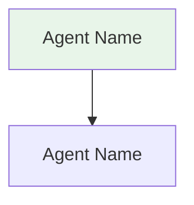
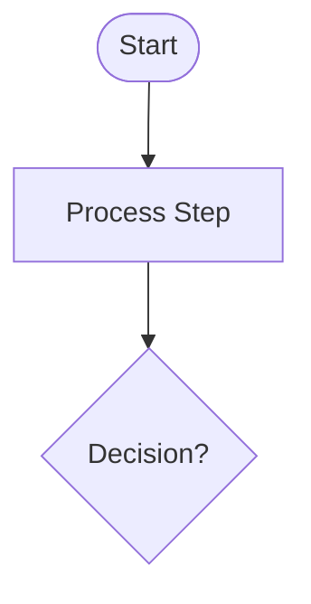
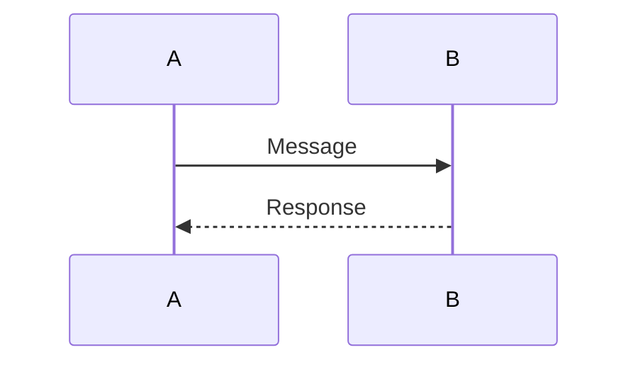

# Exercise: Design a Multi-Agent Customer Support System

## Objective

Design a multi-agent architecture for an intelligent customer support ticket routing system that handles 5,000+ tickets daily with enterprise SLA requirements.

## Learning Goals

- Apply agentic design principles to a real-world problem
- Design specialized agents with clear responsibilities
- Create system architecture and workflow diagrams using Mermaid
- Analyze trade-offs between single-agent and multi-agent approaches
- Plan for failure modes and scalability

## Scenario

Your SaaS company receives 5,000+ support tickets daily across email, chat, and web forms. Current process:
- All tickets go to L1 support
- Manual categorization and routing
- Average response time: 4 hours
- Enterprise SLA: 1 hour (frequently missed)

**Goal**: Design an intelligent system that automatically triages, routes, and resolves tickets.

## Project Structure

```
exercise/starter/
├── ARCHITECTURE.md          # Main deliverable (complete the TODO sections)
└── diagrams/
    ├── multi-agent.mmd      # Multi-agent architecture (fill in)
    ├── sequence.mmd         # Sequence diagram (fill in)
    ├── single-agent.mmd     # Single-agent architecture (provided)
    ├── single-agent.svg     # Single-agent architecture (rendered)
    ├── sla-monitoring.mmd   # SLA monitoring diagram (fill in)
    └── workflow.mmd         # Workflow diagram (fill in)
```

> **Diagrams:** To render a `.mmd` file after editing:
> ```bash
> mmdc -i diagrams/<name>.mmd -o diagrams/<name>.svg
> ```
> `mmdc` is available in the Vocareum workspace. For local use: `npm install -g @mermaid-js/mermaid-cli`
> For syntax reference, see `demo/diagrams/multi-agent.mmd`.

## Your Tasks

### Step 1: Review the Problem (Provided)

Read `ARCHITECTURE.md` and review:
- The Problem Statement
- Requirements Analysis (functional and non-functional requirements)
- Option A: Single Agent Approach (provided as reference)

### Step 2: Design Multi-Agent Architecture

Design 4-6 specialized agents for the support system:
- **Triage Agent** -- Categorizes urgency, type, customer tier
- **Specialized Agents** -- Technical, Billing, Knowledge Base, etc.
- **Routing Agent** -- Determines final destination
- **Escalation Agent** -- Monitors SLA (optional)

For each agent, define:
- Clear responsibility (single purpose)
- Required tools (CRM, KB, APIs, etc.)
- Model selection (Haiku for speed, Sonnet for quality)
- Whether it can run in parallel

### Step 3: Create System Architecture Diagram

Edit `diagrams/multi-agent.mmd` to create a Mermaid graph showing:
- All agents and their relationships
- Data flow between agents
- Parallel vs sequential execution
- Final destinations (auto-response, human team, escalation)

Then render it:
```bash
mmdc -i diagrams/multi-agent.mmd -o diagrams/multi-agent.svg
```

### Step 4: Create Workflow Diagram

Edit `diagrams/workflow.mmd` to create a Mermaid flowchart showing:
- Ticket journey from intake to resolution
- Decision points (if/else logic)
- Parallel processing stages (use dashed arrows `-.->`)
- Different routing outcomes

Then render it:
```bash
mmdc -i diagrams/workflow.mmd -o diagrams/workflow.svg
```

### Step 5: Create Sequence Diagram

Edit `diagrams/sequence.mmd` to create a Mermaid sequence diagram showing:
- Timeline of interactions between components
- Parallel execution using `par` blocks
- Customer interaction points
- SLA monitoring

Then render it:
```bash
mmdc -i diagrams/sequence.mmd -o diagrams/sequence.svg
```

### Step 6: Complete Agent Definitions Table

Fill in the comparison table in `ARCHITECTURE.md` with your agent designs.

### Step 7: Design SLA Monitoring

Edit `diagrams/sla-monitoring.mmd` to design a background escalation agent:
- What triggers escalation?
- How often does it run?
- What actions does it take?

Then render it:
```bash
mmdc -i diagrams/sla-monitoring.mmd -o diagrams/sla-monitoring.svg
```

### Step 8: Analyze Failure Modes

For each critical component, identify:
- What happens if it fails?
- Impact on the system
- Mitigation strategy (fallback, degraded mode, etc.)

### Step 9: Make Your Recommendation

Choose between Option A (Single Agent) or Option B (Multi-Agent) and justify based on:
- Volume requirements (5,000+ tickets/day)
- Speed requirements (1-hour enterprise SLA)
- Complexity of ticket types
- Cost considerations
- Scalability

Provide estimated performance metrics.

## Success Criteria

- [ ] 4-6 specialized agents designed with clear responsibilities
- [ ] System architecture Mermaid diagram created (`diagrams/multi-agent.mmd`)
- [ ] Workflow Mermaid flowchart created (`diagrams/workflow.mmd`)
- [ ] Sequence Mermaid diagram created (`diagrams/sequence.mmd`)
- [ ] Agent definitions table completed (all columns filled)
- [ ] SLA monitoring approach designed (`diagrams/sla-monitoring.mmd`)
- [ ] Failure mode analysis table completed
- [ ] Clear recommendation with justification
- [ ] Performance estimates provided

## Mermaid Diagram Quick Reference

### System Architecture (graph)


### Workflow (flowchart)


### Sequence Diagram


## Tips

1. **Start with responsibilities** -- Define what each agent does before choosing tools
2. **Think parallel** -- Which tasks can run simultaneously vs sequentially?
3. **Plan for failure** -- Every component can fail; what's the fallback?
4. **Balance cost vs quality** -- Use Haiku where speed matters, Sonnet for complex decisions
5. **Keep agents focused** -- Each agent should have one clear purpose
6. **Study the demo** -- The company research architecture shows good patterns
7. **Use Mermaid documentation** -- Refer to https://mermaid.js.org for diagram syntax

## Reference

After completing your design, compare with the solution:
- `../solution/ARCHITECTURE.md`
